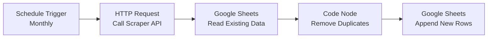

# N8n Workflow Guide: Monthly Scraper Automation with Google Sheets

This guide shows you how to build an n8n workflow that:
1. Runs your scraper **once per month** automatically
2. Adds results to **Google Sheets**
3. **Prevents duplicate investors** from being added

## Overview

Your scraper is a FastAPI application that returns investor data. The n8n workflow will:
- Trigger monthly via a schedule
- Call your scraper API endpoint
- Read existing data from Google Sheets
- Filter out duplicates based on investor name
- Append only new investors to Google Sheets

---

## Workflow Architecture



---

## Step-by-Step Setup

### 1. Schedule Trigger Node

**Node Type:** `Schedule Trigger`

**Configuration:**
- **Trigger Interval:** `Days`
- **Days Between Triggers:** `30` (or use Cron expression for specific date)
- **Alternative (Cron):** `0 0 1 * *` (runs at midnight on the 1st of each month)

> [!TIP]
> Using a cron expression gives you more control. For example, `0 9 1 * *` runs at 9 AM on the 1st of each month.

---

### 2. HTTP Request Node - Call Your Scraper

**Node Type:** `HTTP Request`

**Configuration:**
- **Method:** `GET`
- **URL:** `https://your-deployment-url.railway.app/investors/hillsborough/run_sync`
- **Query Parameters:**
  - `key`: `YOUR_API_KEY` (from your `.env` file)
  - `max_pages`: `450` (adjust as needed)
  - `days_back`: `30` (for monthly data, use 30-35 days to ensure overlap)

**Authentication:** None (API key is in query params)

**Response Format:**
```json
{
  "count": 150,
  "investors": [
    {
      "Name": "JOHN DOE",
      "Address": "123 MAIN ST TAMPA, FL 33601",
      "SaleDate": "2024-01-15",
      "SalePrice": "$250,000",
      "PropertyCount": 5
    }
  ]
}
```

> [!IMPORTANT]
> Use the `/run_sync` endpoint for n8n workflows. The async endpoint won't return data immediately.

---

### 3. Google Sheets - Read Existing Data

**Node Type:** `Google Sheets`

**Configuration:**
- **Operation:** `Read`
- **Document:** Select your Google Sheet
- **Sheet Name:** `Investors` (or your sheet name)
- **Range:** Leave empty to read all data
- **Options:**
  - Enable **"RAW Data"** to get unformatted values

**Purpose:** This reads all existing investors so we can identify duplicates.

---

### 4. Code Node - Remove Duplicates

**Node Type:** `Code`

**Configuration:**
- **Mode:** `Run Once for All Items`

**JavaScript Code:**

```javascript
// Get data from HTTP Request (scraper results)
const scraperData = $input.first().json.investors || [];

// Get existing data from Google Sheets
const existingData = $('Google Sheets - Read Existing Data').all();

// Extract existing investor names (normalize to uppercase for comparison)
const existingNames = new Set(
  existingData.map(item => (item.json.Name || '').toString().trim().toUpperCase())
);

// Filter out duplicates
const newInvestors = scraperData.filter(investor => {
  const investorName = (investor.Name || '').toString().trim().toUpperCase();
  return !existingNames.has(investorName);
});

// Return only new investors
return newInvestors.map(investor => ({ json: investor }));
```

**How it works:**
1. Gets the scraper results from the HTTP Request node
2. Gets existing investors from Google Sheets
3. Creates a Set of existing investor names (case-insensitive)
4. Filters out any investors that already exist
5. Returns only new investors to be added

> [!WARNING]
> This assumes investor names are unique identifiers. If the same investor can have different names (e.g., "JOHN DOE" vs "DOE, JOHN"), you'll need to normalize names or use a different unique identifier.

---

### 5. Google Sheets - Append New Rows

**Node Type:** `Google Sheets`

**Configuration:**
- **Operation:** `Append or Update`
- **Document:** Same Google Sheet as before
- **Sheet Name:** `Investors`
- **Data Mode:** `Auto-Map Input Data`
- **Options:**
  - **Value Input Mode:** `User Entered` (formats dates/numbers properly)

**Column Mapping:**
The node will automatically map fields from your scraper output:
- `Name` → Column A
- `Address` → Column B
- `SaleDate` → Column C
- `SalePrice` → Column D
- `PropertyCount` → Column E

> [!TIP]
> Make sure your Google Sheet has headers in the first row that match your data fields exactly.

---

## Alternative: More Robust Duplicate Detection

If you want to detect duplicates based on multiple fields (e.g., Name + Address), use this enhanced code:

```javascript
// Get data from HTTP Request (scraper results)
const scraperData = $input.first().json.investors || [];

// Get existing data from Google Sheets
const existingData = $('Google Sheets - Read Existing Data').all();

// Create composite keys for existing data (Name + Address)
const existingKeys = new Set(
  existingData.map(item => {
    const name = (item.json.Name || '').toString().trim().toUpperCase();
    const address = (item.json.Address || '').toString().trim().toUpperCase();
    return `${name}|${address}`;
  })
);

// Filter out duplicates based on composite key
const newInvestors = scraperData.filter(investor => {
  const name = (investor.Name || '').toString().trim().toUpperCase();
  const address = (investor.Address || '').toString().trim().toUpperCase();
  const compositeKey = `${name}|${address}`;
  return !existingKeys.has(compositeKey);
});

// Return only new investors
return newInvestors.map(investor => ({ json: investor }));
```

---

## Google Sheets Setup

### Sheet Structure

Create a Google Sheet with these headers in Row 1:

| Name | Address | SaleDate | SalePrice | PropertyCount |
|------|---------|----------|-----------|---------------|
|      |         |          |           |               |

### Permissions

1. Share the Google Sheet with your n8n Google account
2. In n8n, connect your Google account:
   - Go to **Credentials** → **Create New**
   - Select **Google Sheets OAuth2**
   - Follow the authentication flow

---

## Testing Your Workflow

### Manual Test Run

1. Click **"Execute Workflow"** in n8n
2. Check each node's output:
   - **HTTP Request:** Should return investor data
   - **Google Sheets Read:** Should show existing data
   - **Code Node:** Should show only new investors (filtered)
   - **Google Sheets Append:** Should add new rows

### Verify Duplicate Prevention

1. Run the workflow once
2. Check that data is added to Google Sheets
3. Run the workflow again immediately
4. Verify that **no duplicate rows** are added

---

## Monitoring & Error Handling

### Add Error Handling

Add an **IF** node after the Code node:

**Condition:**
```javascript
{{ $json.length > 0 }}
```

- **True:** Continue to Google Sheets Append
- **False:** Send notification (no new investors found)

### Add Notifications

Add a **Send Email** or **Slack** node to notify you when:
- New investors are found and added
- No new investors found
- Errors occur

---

## Advanced: Handling Large Datasets

If your scraper returns thousands of investors, consider:

### Batch Processing

Split the data into batches of 100-500 rows:

```javascript
const batchSize = 100;
const batches = [];

for (let i = 0; i < newInvestors.length; i += batchSize) {
  batches.push(newInvestors.slice(i, i + batchSize));
}

return batches.map(batch => ({ json: { investors: batch } }));
```

Then use a **Loop** node to process each batch separately.

---

## Troubleshooting

### Issue: Duplicates Still Being Added

**Cause:** Name formatting differences (e.g., extra spaces, different cases)

**Solution:** Enhance normalization in the Code node:

```javascript
function normalizeString(str) {
  return (str || '')
    .toString()
    .trim()
    .toUpperCase()
    .replace(/\s+/g, ' '); // Replace multiple spaces with single space
}

const existingNames = new Set(
  existingData.map(item => normalizeString(item.json.Name))
);
```

### Issue: Scraper Times Out

**Cause:** The scraper takes too long to run

**Solution:** 
1. Reduce `max_pages` parameter
2. Use the async endpoint and poll for results
3. Deploy scraper with longer timeout settings

### Issue: Google Sheets API Limit Exceeded

**Cause:** Too many requests to Google Sheets API

**Solution:**
1. Use batch operations
2. Add a **Wait** node between operations
3. Consider using Google Sheets API quotas

---

## Complete Workflow JSON

Here's the complete n8n workflow you can import:

```json
{
  "name": "Monthly Investor Scraper to Google Sheets",
  "nodes": [
    {
      "parameters": {
        "rule": {
          "interval": [
            {
              "field": "cronExpression",
              "expression": "0 9 1 * *"
            }
          ]
        }
      },
      "name": "Schedule Trigger",
      "type": "n8n-nodes-base.scheduleTrigger",
      "position": [250, 300]
    },
    {
      "parameters": {
        "method": "GET",
        "url": "https://your-deployment.railway.app/investors/hillsborough/run_sync",
        "queryParameters": {
          "parameters": [
            {
              "name": "key",
              "value": "YOUR_API_KEY"
            },
            {
              "name": "max_pages",
              "value": "450"
            },
            {
              "name": "days_back",
              "value": "35"
            }
          ]
        }
      },
      "name": "HTTP Request - Scraper",
      "type": "n8n-nodes-base.httpRequest",
      "position": [450, 300]
    },
    {
      "parameters": {
        "operation": "read",
        "sheetId": "YOUR_SHEET_ID",
        "range": "Investors!A:E"
      },
      "name": "Google Sheets - Read Existing",
      "type": "n8n-nodes-base.googleSheets",
      "position": [650, 300]
    },
    {
      "parameters": {
        "jsCode": "// Your duplicate removal code here"
      },
      "name": "Remove Duplicates",
      "type": "n8n-nodes-base.code",
      "position": [850, 300]
    },
    {
      "parameters": {
        "operation": "append",
        "sheetId": "YOUR_SHEET_ID",
        "range": "Investors"
      },
      "name": "Google Sheets - Append New",
      "type": "n8n-nodes-base.googleSheets",
      "position": [1050, 300]
    }
  ],
  "connections": {
    "Schedule Trigger": {
      "main": [[{ "node": "HTTP Request - Scraper", "type": "main", "index": 0 }]]
    },
    "HTTP Request - Scraper": {
      "main": [[{ "node": "Google Sheets - Read Existing", "type": "main", "index": 0 }]]
    },
    "Google Sheets - Read Existing": {
      "main": [[{ "node": "Remove Duplicates", "type": "main", "index": 0 }]]
    },
    "Remove Duplicates": {
      "main": [[{ "node": "Google Sheets - Append New", "type": "main", "index": 0 }]]
    }
  }
}
```

> [!IMPORTANT]
> Replace `YOUR_API_KEY`, `YOUR_SHEET_ID`, and the deployment URL with your actual values.

---

## Summary

This workflow provides:
- ✅ **Monthly automation** via schedule trigger
- ✅ **Duplicate prevention** via name comparison
- ✅ **Google Sheets integration** for data storage
- ✅ **Scalable architecture** for large datasets
- ✅ **Error handling** and monitoring options

The key to duplicate prevention is the Code node that compares new scraper results against existing Google Sheets data before appending.
